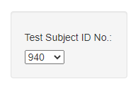
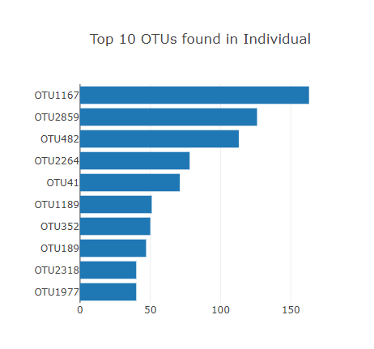
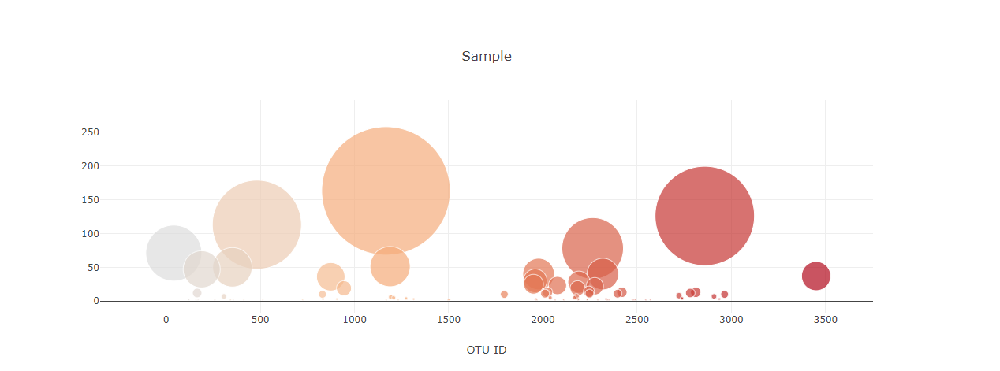
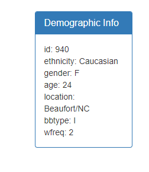
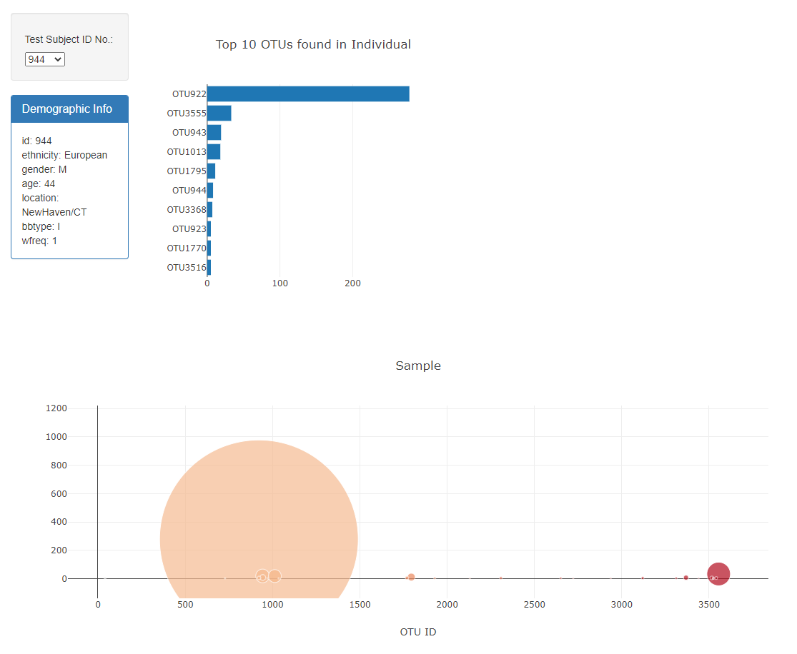

# Belly-Button-Biodiversity

Built an interactive dashboard to explore the Belly Button Biodiversity dataset, which catalogs the microbes that colonize human navels.

The dataset reveals that a small handful of microbial species (also called operational taxonomic units, or OTUs, in the study) were present in more than 70% of people, while the rest were relatively rare.

App was deployed to GitHub Pages (https://sybilec.github.io/Belly-Button-Biodiversity/)

- Used the D3 library to read in samples.json file.

- Created a horizontal bar chart with a dropdown menu to display the top 10 OTUs found in each individual.
    
    

-  Created a bubble chart that displays each sample.
    

- Displayed the sample metadata (an individual's demographic information).
    
    

- Whenever user select a sample id from the dropdown menu, the dashboard will display a panel with the individual demographic information and charts revealing microbes found in individual and their distribution.
    